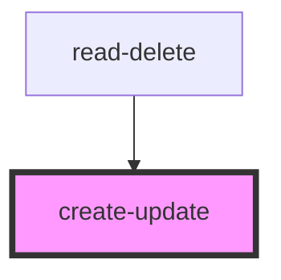

# create-update

<!-- Auto Generated Below -->

## Properties

| Property | Attribute | Description | Type     | Default |
| -------- | --------- | ----------- | -------- | ------- |
| `_id`    | `_id`     |             | `string` | `""`    |

## Dependencies

### Used by

 - [read-delete](../read-delete)

### Graph

----------------------------------------------

*Built with [StencilJS](https://stenciljs.com/)*
