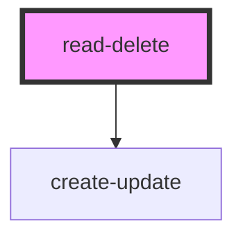

# read-delete

<!-- Auto Generated Below -->

## Dependencies

### Depends on

- [create-update](../create-update)

### Graph

----------------------------------------------

*Built with [StencilJS](https://stenciljs.com/)*
